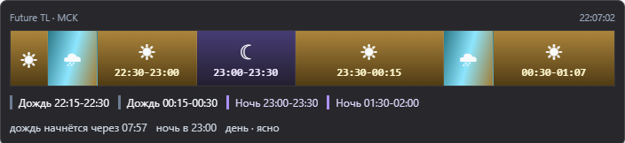
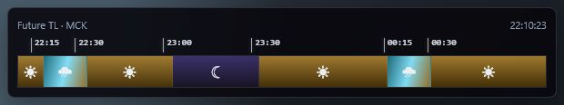
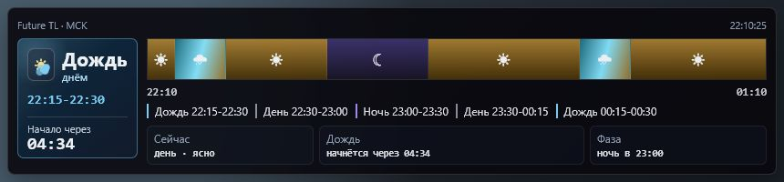
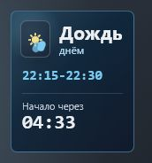

# Future TL Weather Overlay

Компактный Windows overlay для отслеживания погодных циклов Future TL / Throne
and Liberty.

Overlay запускается отдельным приложением поверх окна игры и показывает текущую
и ближайшую погоду: день, ночь, начало дождя и окончание дождя.

## Безопасность

Приложение сделано как отдельный overlay и не является модификацией файлов игры.

- Не изменяет файлы игры.
- Не читает память игры.
- Не внедряется в процесс игры.
- Не автоматизирует ввод.
- В обычном режиме работает как click-through окно и не мешает управлению.
- Меню настроек открывается отдельно и не привязано к положению ленты.
- Автоматически закрывается после завершения процесса игры `TL`.
- Проверяет обновления через GitHub Releases и устанавливает их только после нажатия пользователем кнопки `ОБНОВИТЬ`.
- Позволяет изменить shortcut открытия и закрытия настроек.

## Возможности

- Отображение поверх игры в режиме always-on-top.
- Горячие клавиши для настроек и скрытия overlay.
- Перемещение ленты мышью в режиме настройки.
- Настройка ширины, прозрачности и масштаба.
- Четыре пресета дизайна:
  - `Стандартная` - широкая информативная лента.
  - `Компактная` - узкая лента с отметками старта фаз.
  - `Подробная` - расширенная лента с ближайшим дождём и будущими событиями.
  - `Дождь` - небольшой блок только с информацией о ближайшем дожде.
- Разные цвета дождя днём и ночью.
- Автоматическое скрытие будущих событий, если они не помещаются по ширине.
- Автоматическое завершение overlay после закрытия Throne and Liberty.
- Автоматическая проверка обновлений с тихой установкой и перезапуском overlay.
- Пользовательская комбинация клавиш для окна настроек.
- Звуковые уведомления за 5 минут до дождя и смены дня или ночи.
- Включение и выключение уведомлений, а также настройка их громкости.
- Кнопка полного завершения overlay в настройках.

## Скриншоты

### Стандартная



### Компактная



### Подробная



### Дождь



## Установка

Для обычного пользователя проще всего скачать готовый файл на странице
`Releases`:

- `Future-TL-Weather-Overlay-Portable-0.1.3.exe` - portable-версия, установка не нужна.
- `Future-TL-Weather-Overlay-Setup-0.1.3.exe` - установщик Windows.

Если Windows SmartScreen показывает предупреждение о неизвестном издателе, это
означает, что приложение пока не подписано коммерческим code-signing
сертификатом.

## Управление

- `Ctrl+Shift+W` - открыть или закрыть настройки.
- `Ctrl+Shift+H` - скрыть или показать overlay.
- В режиме настроек ленту можно перетаскивать мышью.
- Когда настройки закрыты, overlay не перехватывает клики мыши.
- Если игра уже запускалась и процесс `TL` завершился, overlay полностью закрывается сам.
- Если доступна новая версия, в настройках появится кнопка `ОБНОВИТЬ`.
- После нажатия `ОБНОВИТЬ` overlay скачает обновление, установит его тихо и перезапустится.
- Shortcut открытия настроек можно изменить в окне настроек.
- Звуковые уведомления и их громкость настраиваются в отдельном блоке окна настроек.
- Кнопка `ВЫКЛЮЧИТЬ ОВЕРЛЕЙ` полностью завершает процесс overlay.

## Сборка из исходников

Требования:

- Windows
- Node.js
- npm

Установка зависимостей:

```bash
npm install
```

Запуск overlay:

```bash
npm run overlay
```

Проверки:

```bash
npm test
npm run overlay:check
```

Сборка Windows-версий:

```bash
npm run package:win
```

Готовые файлы будут созданы в папке `release/`. Эта папка не хранится в git,
чтобы в репозиторий не попадали тяжёлые сборочные артефакты.

## Источник данных

Подробная информация о смене циклов погоды: https://futuretl.ru/

Проект разработан при поддержке  
Гильдии "FUTURE" | Сервер "Джанарот"
